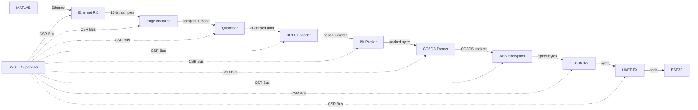
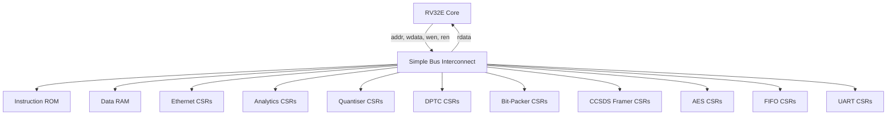

# FPGA Telemetry Pipeline — Data Flow & Module Specification

## System Overview

The FPGA implements a **real-time streaming telemetry processor** that receives sensor data from MATLAB, compresses it adaptively, encrypts it, and transmits it to an ESP32 Wi-Fi bridge over UART. An embedded **RV32E supervisor core** provides runtime configuration, monitoring, and error management across all pipeline stages.



All pipeline modules operate synchronously at the system clock and process **one sample per clock cycle**. The RV32E supervisor connects to each module via a shared memory-mapped CSR bus and runs independently from the data path.

---

## Data Width Evolution

| Stage | Data Representation | Typical Width |
|---|---|---|
| Raw Input | Unsigned integer samples | 12–16 bits |
| After Quantiser | Right-shifted (reduced precision) | 8–16 bits (depends on Q) |
| After DPTC | Signed deltas between consecutive samples | 2–8 bits typical |
| After Bit-Packer | Dense packed bitstream, byte-aligned | 8 bits per beat |
| After CCSDS Framer | Framed CCSDS Space Packets | 8 bits per beat (with 6-byte header + CRC-16) |
| After AES | 128-bit encrypted cipher blocks | 128 bits → serialised to 8-bit |
| UART Output | Serial byte stream | 1 bit (serial line) |

---

# Module Specifications

---

## 1. Ethernet Receive / Input Interface

### Purpose
Accepts raw Ethernet frames from MATLAB over an MII/RMII PHY interface, validates them, and extracts fixed-format telemetry sample payloads.

### Functional Description
1. Detects Start-of-Frame Delimiter (SFD) on the Ethernet PHY bus
2. Captures destination MAC, EtherType, and payload bytes
3. Validates frame CRC-32 (discard corrupted frames)
4. Extracts 16-bit sample words and an 8-bit channel/timestamp tag from the payload
5. Asserts `sample_valid` for each extracted sample

### Interface Signals

| Signal | Direction | Width | Description |
|---|---|---|---|
| `clk` | Input | 1 | System clock |
| `rst_n` | Input | 1 | Active-low reset |
| `eth_rx_data` | Input | 8 | MII/RMII receive data from PHY |
| `eth_rx_valid` | Input | 1 | PHY data valid |
| `eth_rx_err` | Input | 1 | PHY receive error |
| `sample_data` | Output | 16 | Extracted sample value |
| `sample_valid` | Output | 1 | Sample available this cycle |
| `channel_id` | Output | 4 | Source channel identifier |
| `timestamp` | Output | 16 | Sample timestamp tag |
| `frame_error` | Output | 1 | CRC or format error detected |

### RV32E CSR Interface

| Address Offset | Register | R/W | Description |
|---|---|---|---|
| `0x00` | `ETH_CTRL` | R/W | `[0]` enable, `[1]` loopback mode, `[2]` promiscuous |
| `0x04` | `ETH_STATUS` | R | `[0]` link up, `[1]` frame error (sticky), `[2]` overflow |
| `0x08` | `ETH_RX_COUNT` | R | 32-bit count of valid frames received |
| `0x0C` | `ETH_ERR_COUNT` | R | 32-bit count of CRC/format errors |
| `0x10` | `ETH_MAC_FILTER_H` | R/W | Upper 16 bits of destination MAC filter |
| `0x14` | `ETH_MAC_FILTER_L` | R/W | Lower 32 bits of destination MAC filter |

### Resource Estimate
~800–1200 LUTs, 0 BRAM

---

## 2. Edge Analytics Engine

### Purpose
Monitors the incoming signal characteristics in real time and selects the optimal compression mode. Computes a variation metric (Mean Absolute Deviation) over a sliding window and classifies the signal as **stable**, **moderate**, or **volatile**.

### Functional Description
1. Maintains a sliding window of `N` recent samples (default `N = 16`)
2. Computes the running MAD: `MAD = (1/N) × Σ|sample[i] − mean|`
3. Compares MAD against two programmable thresholds:
   - `MAD < T_low` -> **Mode 1** (stable lossy): signal is healthy/stable, quantise to save bandwidth
   - `T_low <= MAD < T_high` -> **Mode 0** (lossless detail): moderate variation, preserve precision
   - `MAD >= T_high` -> **Mode 0** (lossless detail): volatile/anomalous signal, preserve precision
4. Outputs the computed Q (quantisation shift amount) and the selected mode alongside the sample

### Interface Signals

| Signal | Direction | Width | Description |
|---|---|---|---|
| `clk` | Input | 1 | System clock |
| `rst_n` | Input | 1 | Active-low reset |
| `sample_in` | Input | 16 | Input sample from Ethernet RX |
| `sample_valid_in` | Input | 1 | Input valid strobe |
| `data_out` | Output | 16 | Passed-through sample |
| `data_valid_out` | Output | 1 | Output valid strobe |
| `mode` | Output | 2 | `00` = lossless detail, `01` = stable lossy, `10` = reserved/CSR heavy lossy |
| `Q` | Output | 4 | Quantisation shift amount (0–15) |

### Mode Selection Logic (Default Thresholds)

| Condition | Mode | Q Value | Effect |
|---|---|---|---|
| `MAD < 50` | `01` (stable lossy) | `2` | Quantise healthy data to save bandwidth |
| `50 <= MAD < 200` | `00` (lossless detail) | `0` | Preserve detail when data varies |
| `MAD >= 200` | `00` (lossless detail) | `0` | Preserve anomaly evidence |

### RV32E CSR Interface

| Address Offset | Register | R/W | Description |
|---|---|---|---|
| `0x00` | `ANA_CTRL` | R/W | `[0]` enable, `[1]` force mode override, `[3:2]` forced mode |
| `0x04` | `ANA_THRESH_LOW` | R/W | Lower MAD threshold (T_low), 16-bit |
| `0x08` | `ANA_THRESH_HIGH` | R/W | Upper MAD threshold (T_high), 16-bit |
| `0x0C` | `ANA_WINDOW_SIZE` | R/W | Sliding window size (power of 2, default 16) |
| `0x10` | `ANA_STATUS` | R | `[1:0]` current mode, `[15:2]` current MAD value |
| `0x14` | `ANA_SAMPLE_COUNT` | R | Total samples processed (32-bit) |
| `0x18` | `ANA_Q_OVERRIDE` | R/W | `[0]` override enable, `[7:4]` forced Q value |

### Resource Estimate
~350–600 LUTs, 0 BRAM

---

## 3. Quantiser (Lossy Compression Stage)

### Purpose
Reduces sample precision by arithmetic right-shifting, discarding LSBs when the analytics engine determines the signal is volatile enough to tolerate precision loss.

### Functional Description
1. Receives the sample and the Q value from the analytics engine
2. Performs: `quantised = sample >>> Q` (arithmetic right shift, preserving sign)
3. In lossless mode (`Q = 0`), the sample passes through unchanged
4. The quantised value is forwarded to the DPTC encoder

### Interface Signals

| Signal | Direction | Width | Description |
|---|---|---|---|
| `clk` | Input | 1 | System clock |
| `rst_n` | Input | 1 | Active-low reset |
| `data_in` | Input | 16 | Input sample |
| `Q` | Input | 4 | Shift amount from analytics (or CSR override) |
| `mode` | Input | 2 | Compression mode (passed through) |
| `valid_in` | Input | 1 | Input valid |
| `data_out` | Output | 16 | Quantised sample |
| `mode_out` | Output | 2 | Mode (passed through) |
| `valid_out` | Output | 1 | Output valid |

### RV32E CSR Interface

| Address Offset | Register | R/W | Description |
|---|---|---|---|
| `0x00` | `QUANT_CTRL` | R/W | `[0]` enable, `[1]` bypass (force Q=0) |
| `0x04` | `QUANT_STATUS` | R | `[3:0]` current Q value in use |

### Resource Estimate
~30–50 LUTs (barrel shifter / mux logic, mostly wiring)

---

## 4. DPTC Encoder (Delta Predictive Transform Coding)

### Purpose
Removes temporal redundancy by encoding the **difference** between consecutive samples rather than absolute values. For stable signals, deltas are very small and compress well.

### Functional Description
1. Stores the previous sample in a register (`prev_sample`)
2. Computes: `delta = sample[n] − prev_sample`
3. Determines the minimum number of bits needed to represent the signed delta:
   - e.g., delta = `+3` → `bit_width = 3` (sign + 2 value bits)
   - e.g., delta = `−1` → `bit_width = 2`
   - e.g., delta = `0` → `bit_width = 1`
4. Outputs the delta value and its computed bit width
5. First sample in a stream is sent as an absolute value (flag bit set)

### Interface Signals

| Signal | Direction | Width | Description |
|---|---|---|---|
| `clk` | Input | 1 | System clock |
| `rst_n` | Input | 1 | Active-low reset |
| `sample_in` | Input | 16 | Quantised input sample |
| `valid_in` | Input | 1 | Input valid |
| `delta_out` | Output | 16 | Signed delta value (or absolute for first sample) |
| `bit_width` | Output | 5 | Number of significant bits in delta (1–16) |
| `is_absolute` | Output | 1 | `1` = this is an absolute sample, not a delta |
| `valid_out` | Output | 1 | Output valid |

### RV32E CSR Interface

| Address Offset | Register | R/W | Description |
|---|---|---|---|
| `0x00` | `DPTC_CTRL` | R/W | `[0]` enable, `[1]` force reset (re-sync, next sample treated as absolute) |
| `0x04` | `DPTC_STATUS` | R | `[4:0]` last bit_width, `[5]` last was absolute |
| `0x08` | `DPTC_AVG_WIDTH` | R | Running average of bit_width (8.8 fixed point) — indicates compression efficiency |
| `0x0C` | `DPTC_DELTA_COUNT` | R | Total deltas emitted (32-bit) |

### Resource Estimate
~300–500 LUTs, 0 BRAM

---

## 5. Bit-Packer

### Purpose
Packs the variable-width delta stream from the DPTC encoder into a **dense, byte-aligned bitstream**. Without this module, each delta would waste padding bits up to the full 16-bit width.

> [!NOTE]
> This module handles **compression output formatting only**. Packet framing (headers, sequencing, checksums) is handled by the separate CCSDS Framer (Module 6).

### Functional Description
1. Maintains a **shift register accumulator** (64 bits wide)
2. For each incoming delta, shifts it into the accumulator at the current bit position
3. When 8+ bits have accumulated, emits a byte and advances the read pointer
4. Signals `chunk_done` after `N` samples have been packed (configurable via CSR), at which point the CCSDS Framer closes the current packet
5. On a mode change from the analytics engine, forces a flush of the current chunk

### Interface Signals

| Signal | Direction | Width | Description |
|---|---|---|---|
| `clk` | Input | 1 | System clock |
| `rst_n` | Input | 1 | Active-low reset |
| `delta_in` | Input | 16 | Delta value from DPTC |
| `bit_width` | Input | 5 | Bit width of this delta |
| `is_absolute` | Input | 1 | Absolute sample flag |
| `valid_in` | Input | 1 | Input valid |
| `byte_out` | Output | 8 | Packed output byte |
| `byte_valid` | Output | 1 | Output byte is valid |
| `chunk_done` | Output | 1 | Asserted when N samples have been packed (triggers CCSDS packet close) |

### RV32E CSR Interface

| Address Offset | Register | R/W | Description |
|---|---|---|---|
| `0x00` | `BPACK_CTRL` | R/W | `[0]` enable, `[1]` force flush (emit partial chunk) |
| `0x04` | `BPACK_CHUNK_SIZE` | R/W | Samples per chunk / CCSDS packet (default 64) |
| `0x08` | `BPACK_STATUS` | R | `[5:0]` current accumulator fill level (bits) |
| `0x0C` | `BPACK_BYTE_COUNT` | R | Total payload bytes emitted (32-bit) |

### Resource Estimate
~250–400 LUTs, 0 BRAM

---

## 6. CCSDS Framer (Packet Framing)

### Purpose
Wraps the packed byte stream from the Bit-Packer into **CCSDS Space Packet Protocol** (SPP, Blue Book CCSDS 133.0-B-2) compliant telemetry packets. This makes the output compatible with standard ground station software (NASA AMMOS, ESA SCOS-2000, SatNOGS, Yamcs).

### Functional Description
1. When a new chunk begins, emits the **6-byte CCSDS Primary Header**
2. Immediately after, emits the **5-byte Secondary Header** (mission-specific metadata)
3. Passes through the packed payload bytes from the Bit-Packer
4. When `chunk_done` is asserted, appends a **CRC-16** (CCSDS standard polynomial) and closes the packet
5. Auto-increments the 14-bit **sequence counter** per packet

### CCSDS Packet Format

```
┌─────────────────────────────────────────────────────────────────┐
│              CCSDS Primary Header (6 bytes)                     │
├────────────┬────────┬──────────────┬───────────────────────────┤
│ Version    │ Type   │ Sec Hdr Flag │ APID (11 bits)            │
│ 000        │ 0 (TM) │ 1            │ Programmable via CSR      │
├────────────┴────────┴──────────────┴───────────────────────────┤
│ Seq Flags (2b) │ Sequence Count (14 bits, auto-increment)      │
├────────────────┴──────────────────────────────────────────────┤
│ Packet Data Length (16 bits) = payload + sec header - 1        │
├──────────────────────────────────────────────────────────────────┤
│              Secondary Header (5 bytes, mission-specific)       │
├──────────────────────────────────────────────────────────────────┤
│ Timestamp (32 bits)   │ Mode (2b) │ Q (4b) │ Reserved (2b)     │
├──────────────────────────────────────────────────────────────────┤
│              Packed Delta Payload (variable length)              │
├──────────────────────────────────────────────────────────────────┤
│              CRC-16 (2 bytes, CCSDS polynomial)                 │
└──────────────────────────────────────────────────────────────────┘
```

**APID Assignment (Recommended):**

| APID | Channel |
|---|---|
| `0x001` | Vibration / Accelerometer |
| `0x002` | Temperature / Environmental |
| `0x003` | Attitude / Navigation |
| `0x004` | Power / Battery |
| `0x010` | System Health (from RV32E supervisor) |

### Interface Signals

| Signal | Direction | Width | Description |
|---|---|---|---|
| `clk` | Input | 1 | System clock |
| `rst_n` | Input | 1 | Active-low reset |
| `payload_byte` | Input | 8 | Packed byte from Bit-Packer |
| `payload_valid` | Input | 1 | Byte valid from Bit-Packer |
| `chunk_done` | Input | 1 | End-of-chunk signal from Bit-Packer |
| `mode` | Input | 2 | Current compression mode (for secondary header) |
| `Q` | Input | 4 | Quantisation level (for secondary header) |
| `timestamp` | Input | 32 | Timestamp value (for secondary header) |
| `byte_out` | Output | 8 | CCSDS packet byte (header + payload + CRC) |
| `byte_valid` | Output | 1 | Output byte is valid |
| `packet_start` | Output | 1 | Marks first byte of a new CCSDS packet |
| `packet_end` | Output | 1 | Marks last byte (CRC) of a CCSDS packet |

### RV32E CSR Interface

| Address Offset | Register | R/W | Description |
|---|---|---|---|
| `0x00` | `CCSDS_CTRL` | R/W | `[0]` enable |
| `0x04` | `CCSDS_APID` | R/W | 11-bit Application Process Identifier |
| `0x08` | `CCSDS_STATUS` | R | `[13:0]` current sequence count, `[14]` packet in progress |
| `0x0C` | `CCSDS_PKT_COUNT` | R | Total CCSDS packets emitted (32-bit) |

### Resource Estimate
~100–150 LUTs, 0 BRAM

---

## 7. AES Encryption Core

### Purpose
Encrypts outgoing telemetry packets before transmission to ensure data confidentiality. Implements AES-128 in an **iterative** (round-sharing) architecture to minimise area.

### Functional Description
1. Accepts a 128-bit plaintext block and a 128-bit key
2. Executes 10 AES rounds iteratively (one round per clock cycle):
   - SubBytes → ShiftRows → MixColumns → AddRoundKey
   - Final round omits MixColumns
3. Key schedule is computed on-the-fly (one round key per cycle)
4. After 10+1 cycles, the 128-bit ciphertext block is ready
5. Ciphertext is serialised into 16 sequential bytes for the FIFO

### Timing
- **Latency**: 11 clock cycles per 128-bit block
- **Throughput**: 1 block every 11 cycles → at 100 MHz: ~145 MB/s (far exceeds UART bandwidth)

### Interface Signals

| Signal | Direction | Width | Description |
|---|---|---|---|
| `clk` | Input | 1 | System clock |
| `rst_n` | Input | 1 | Active-low reset |
| `plain_block` | Input | 128 | Plaintext input block |
| `plain_valid` | Input | 1 | Start encryption |
| `key` | Input | 128 | AES-128 encryption key |
| `cipher_block` | Output | 128 | Encrypted output block |
| `cipher_valid` | Output | 1 | Encryption complete, output valid |
| `busy` | Output | 1 | Core is processing a block |

### RV32E CSR Interface

| Address Offset | Register | R/W | Description |
|---|---|---|---|
| `0x00` | `AES_CTRL` | R/W | `[0]` enable, `[1]` key update trigger |
| `0x04` | `AES_STATUS` | R | `[0]` busy, `[1]` key loaded |
| `0x08` | `AES_KEY_0` | W | Key bits `[31:0]` |
| `0x0C` | `AES_KEY_1` | W | Key bits `[63:32]` |
| `0x10` | `AES_KEY_2` | W | Key bits `[95:64]` |
| `0x14` | `AES_KEY_3` | W | Key bits `[127:96]` |
| `0x18` | `AES_BLOCK_COUNT` | R | Total blocks encrypted (32-bit) |

> [!IMPORTANT]
> The key registers are **write-only** for security — the CPU cannot read back the key. Writing all four key words followed by setting `AES_CTRL[1]` loads the new key.

### Resource Estimate
~1400–1800 LUTs, 0 BRAM (S-Box implemented as LUT logic)

---

## 8. FIFO Buffer (Rate Matching)

### Purpose
Absorbs the speed mismatch between the fast FPGA pipeline (MHz throughput) and the slow UART transmitter (baud-rate limited). Prevents data loss during bursts.

### Functional Description
1. Implements a standard synchronous FIFO using one 18 Kb BRAM block
2. Write side: accepts bytes from the AES serialiser whenever `write_en` is asserted
3. Read side: feeds bytes to the UART TX whenever it is ready and FIFO is non-empty
4. Generates `full`, `empty`, `almost_full`, and `almost_empty` flags
5. On overflow (write when full), `overflow_flag` latches high until cleared by the CPU

### Interface Signals

| Signal | Direction | Width | Description |
|---|---|---|---|
| `clk` | Input | 1 | System clock |
| `rst_n` | Input | 1 | Active-low reset |
| `wr_data` | Input | 8 | Write data (from AES serialiser) |
| `wr_en` | Input | 1 | Write enable |
| `rd_data` | Output | 8 | Read data (to UART TX) |
| `rd_en` | Input | 1 | Read enable (from UART TX ready) |
| `full` | Output | 1 | FIFO is full |
| `empty` | Output | 1 | FIFO is empty |
| `almost_full` | Output | 1 | FIFO level ≥ programmable high-water mark |
| `almost_empty` | Output | 1 | FIFO level ≤ programmable low-water mark |
| `overflow` | Output | 1 | Sticky overflow flag |

### RV32E CSR Interface

| Address Offset | Register | R/W | Description |
|---|---|---|---|
| `0x00` | `FIFO_CTRL` | R/W | `[0]` enable, `[1]` flush (clear all data), `[2]` clear overflow flag |
| `0x04` | `FIFO_STATUS` | R | `[0]` empty, `[1]` full, `[2]` almost full, `[3]` overflow occurred |
| `0x08` | `FIFO_LEVEL` | R | Current fill level (number of bytes stored) |
| `0x0C` | `FIFO_WATERMARK` | R/W | Almost-full threshold (default: 75% capacity) |

### Resource Estimate
~100 LUTs (control logic), 1 BRAM block (18 Kb = 2048 bytes depth)

---

## 9. UART Transmitter

### Purpose
Serialises packet bytes into a standard UART frame (start bit, 8 data bits, stop bit) for the ESP32 Wi-Fi bridge.

### Functional Description
1. Accepts a byte from the FIFO when `tx_ready` is asserted
2. Generates the UART frame: `[IDLE=1][START=0][D0][D1]...[D7][STOP=1]`
3. Baud rate is set by a programmable divisor: `baud = clk_freq / (divisor + 1)`
4. Asserts `tx_ready` when the shift register is empty and a new byte can be accepted

### Interface Signals

| Signal | Direction | Width | Description |
|---|---|---|---|
| `clk` | Input | 1 | System clock |
| `rst_n` | Input | 1 | Active-low reset |
| `tx_data` | Input | 8 | Byte to transmit |
| `tx_valid` | Input | 1 | Byte is valid, start transmission |
| `tx_ready` | Output | 1 | Transmitter ready for next byte |
| `uart_tx` | Output | 1 | Serial output to ESP32 |

### RV32E CSR Interface

| Address Offset | Register | R/W | Description |
|---|---|---|---|
| `0x00` | `UART_CTRL` | R/W | `[0]` enable |
| `0x04` | `UART_BAUD_DIV` | R/W | 16-bit baud rate divisor (default: 867 for 115200 @ 100 MHz) |
| `0x08` | `UART_STATUS` | R | `[0]` tx busy, `[1]` tx ready |
| `0x0C` | `UART_TX_COUNT` | R | Total bytes transmitted (32-bit) |

### Resource Estimate
~250–400 LUTs, 0 BRAM

---

# RV32E Supervisor Core

## Purpose
Provides runtime configuration, health monitoring, and error recovery for the streaming pipeline. The CPU does **not** participate in the data path — it only writes control registers and reads status registers over the CSR bus.

## Core Specification

| Parameter | Value |
|---|---|
| ISA | RV32E (16 registers, 32-bit) |
| Microarchitecture | Multicycle (3–5 CPI) |
| Pipeline stages | None (FSM-based) |
| Clock | Same system clock as pipeline |
| Instruction memory | 4 KB BRAM (ROM, firmware) |
| Data memory | 2 KB BRAM (stack, variables) |
| Extensions | None (base integer only) |
| Interrupts | 8 external IRQ lines |

## Instructions Supported

All **RV32E base integer** instructions:
- `LUI`, `AUIPC`, `JAL`, `JALR`
- `BEQ`, `BNE`, `BLT`, `BGE`, `BLTU`, `BGEU`
- `LB`, `LH`, `LW`, `LBU`, `LHU`, `SB`, `SH`, `SW`
- `ADDI`, `SLTI`, `SLTIU`, `XORI`, `ORI`, `ANDI`, `SLLI`, `SRLI`, `SRAI`
- `ADD`, `SUB`, `SLL`, `SLT`, `SLTU`, `XOR`, `SRL`, `SRA`, `OR`, `AND`

## Memory Map

```
0x0000_0000 ┬─────────────────────────────┐
             │  Instruction ROM (4 KB)     │  Firmware code
0x0000_0FFF ┤                             │
0x0000_1000 ├─────────────────────────────┤
             │  Data RAM (2 KB)            │  Stack + variables
0x0000_17FF ┤                             │
             ├─────────────────────────────┤
             │  (Reserved)                 │
0x1000_0000 ├─────────────────────────────┤
             │  Ethernet RX CSRs           │  0x1000_0000 – 0x1000_001F
0x1000_1000 ├─────────────────────────────┤
             │  Edge Analytics CSRs        │  0x1000_1000 – 0x1000_101F
0x1000_2000 ├─────────────────────────────┤
             │  Quantiser CSRs             │  0x1000_2000 – 0x1000_200F
0x1000_3000 ├─────────────────────────────┤
             │  DPTC Encoder CSRs          │  0x1000_3000 – 0x1000_301F
0x1000_4000 ├─────────────────────────────┤
             │  Bit-Packer CSRs            │  0x1000_4000 – 0x1000_400F
0x1000_4800 ├─────────────────────────────┤
             │  CCSDS Framer CSRs          │  0x1000_4800 – 0x1000_480F
0x1000_5000 ├─────────────────────────────┤
             │  AES Core CSRs              │  0x1000_5000 – 0x1000_501F
0x1000_6000 ├─────────────────────────────┤
             │  FIFO CSRs                  │  0x1000_6000 – 0x1000_600F
0x1000_7000 ├─────────────────────────────┤
             │  UART TX CSRs               │  0x1000_7000 – 0x1000_700F
             └─────────────────────────────┘
```

## Bus Architecture



The bus interconnect is a simple **address decoder** — it routes read/write transactions based on the upper address bits. No arbitration is needed since only the CPU is a bus master.

## Interrupt Sources

| IRQ | Source | Trigger Condition |
|---|---|---|
| `IRQ[0]` | Ethernet RX | Frame error detected |
| `IRQ[1]` | Edge Analytics | Mode change occurred |
| `IRQ[2]` | DPTC Encoder | Sync lost (gap in valid stream) |
| `IRQ[3]` | Packetiser | Packet completed |
| `IRQ[4]` | AES Core | Encryption complete |
| `IRQ[5]` | FIFO | Almost-full threshold crossed |
| `IRQ[6]` | FIFO | Overflow occurred |
| `IRQ[7]` | UART TX | Transmission idle (all data sent) |

---

# Supervisor Firmware Examples

## Initialisation Sequence (C)

```c
#define ETH_CTRL       (*(volatile uint32_t *)0x10000000)
#define ANA_CTRL       (*(volatile uint32_t *)0x10001000)
#define ANA_THRESH_LOW (*(volatile uint32_t *)0x10001004)
#define ANA_THRESH_HIGH (*(volatile uint32_t *)0x10001008)
#define AES_CTRL       (*(volatile uint32_t *)0x10005000)
#define AES_KEY_0      (*(volatile uint32_t *)0x10005008)
#define AES_KEY_1      (*(volatile uint32_t *)0x1000500C)
#define AES_KEY_2      (*(volatile uint32_t *)0x10005010)
#define AES_KEY_3      (*(volatile uint32_t *)0x10005014)
#define UART_BAUD_DIV  (*(volatile uint32_t *)0x10007004)
#define FIFO_WATERMARK (*(volatile uint32_t *)0x1000600C)

void init_pipeline(void) {
    // Set compression thresholds
    ANA_THRESH_LOW  = 50;
    ANA_THRESH_HIGH = 200;

    // Load AES key
    AES_KEY_0 = 0x2B7E1516;
    AES_KEY_1 = 0x28AED2A6;
    AES_KEY_2 = 0xABF71588;
    AES_KEY_3 = 0x09CF4F3C;
    AES_CTRL  = 0x03;  // enable + key update trigger

    // Configure UART (115200 baud @ 100 MHz)
    UART_BAUD_DIV = 867;

    // Set FIFO warning level
    FIFO_WATERMARK = 1536;  // 75% of 2048

    // Enable analytics and Ethernet
    ANA_CTRL = 0x01;
    ETH_CTRL = 0x01;
}
```

## Runtime Monitoring Loop (C)

```c
#define FIFO_STATUS    (*(volatile uint32_t *)0x10006004)
#define FIFO_LEVEL     (*(volatile uint32_t *)0x10006008)
#define FIFO_CTRL      (*(volatile uint32_t *)0x10006000)
#define ETH_ERR_COUNT  (*(volatile uint32_t *)0x1000000C)

void monitor_loop(void) {
    while (1) {
        // Check FIFO pressure
        if (FIFO_STATUS & 0x04) {  // almost_full
            ANA_THRESH_LOW  = 30;  // more aggressive compression
            ANA_THRESH_HIGH = 100;
        }

        // Check for overflow → clear and log
        if (FIFO_STATUS & 0x08) {
            FIFO_CTRL = 0x04;  // clear overflow flag
            // log error...
        }

        // Check Ethernet errors
        if (ETH_ERR_COUNT > 100) {
            // too many errors, consider reset
        }
    }
}
```

---

# Resource Summary

| Module | LUTs | BRAM | DSP |
|---|---|---|---|
| Ethernet Interface | ~1000 | 0 | 0 |
| Edge Analytics | ~500 | 0 | 0 |
| Quantiser | ~40 | 0 | 0 |
| DPTC Encoder | ~400 | 0 | 0 |
| Bit-Packer | ~350 | 0 | 0 |
| CCSDS Framer | ~130 | 0 | 0 |
| AES Core | ~1600 | 0 | 0 |
| FIFO Buffer | ~100 | 1 | 0 |
| UART TX | ~300 | 0 | 0 |
| RV32E Core | ~1200 | 0 | 0 |
| Instruction ROM (4 KB) | 0 | 1 | 0 |
| Data RAM (2 KB) | 0 | 1 | 0 |
| Bus Interconnect + CSR Decoders | ~300 | 0 | 0 |
| Control / Glue Logic | ~300 | 0 | 0 |
| **Total** | **~6220** | **3** | **0** |

### Device Fit

| Device | LUTs | BRAM | Utilisation (LUT) |
|---|---|---|---|
| XC7S15 | ~9k | 10 | ~70% ⚠️ Feasible but tight |
| XC7S25 | ~14.6k | 45 | **~43%** ✅ Comfortable |

## See Also


- [System Comparison: CubeSat & UAV Telemetry](comparison.md) — Detailed analysis of how this architecture compares to existing industry solutions.
- [Sensor Data Types](sensor_types.md) — Breakdown of supported sensor inputs and compression performance.
